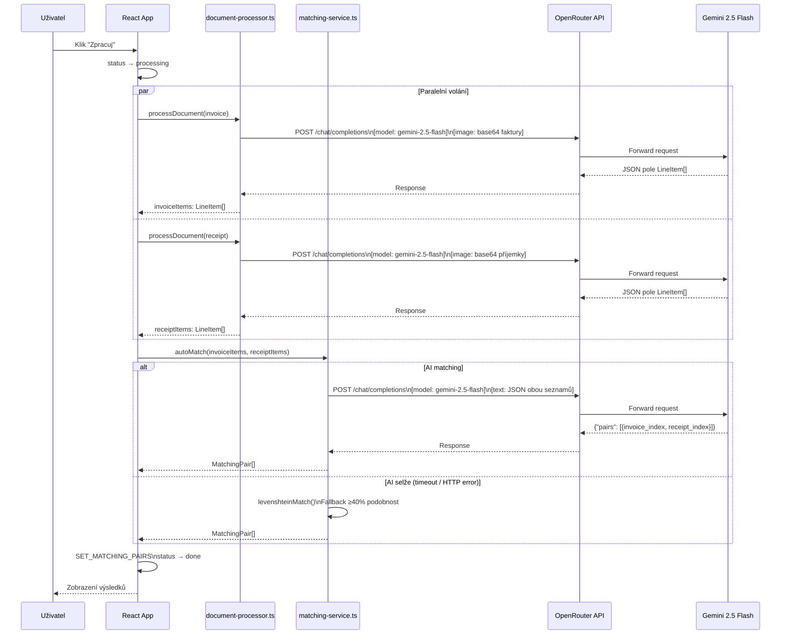
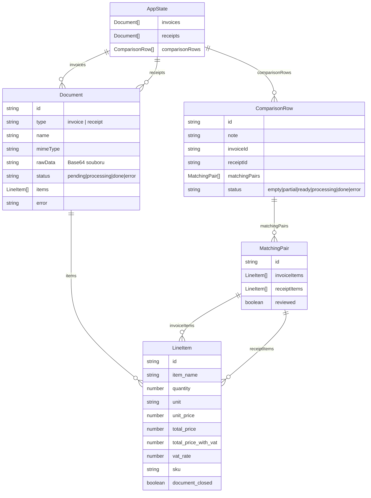
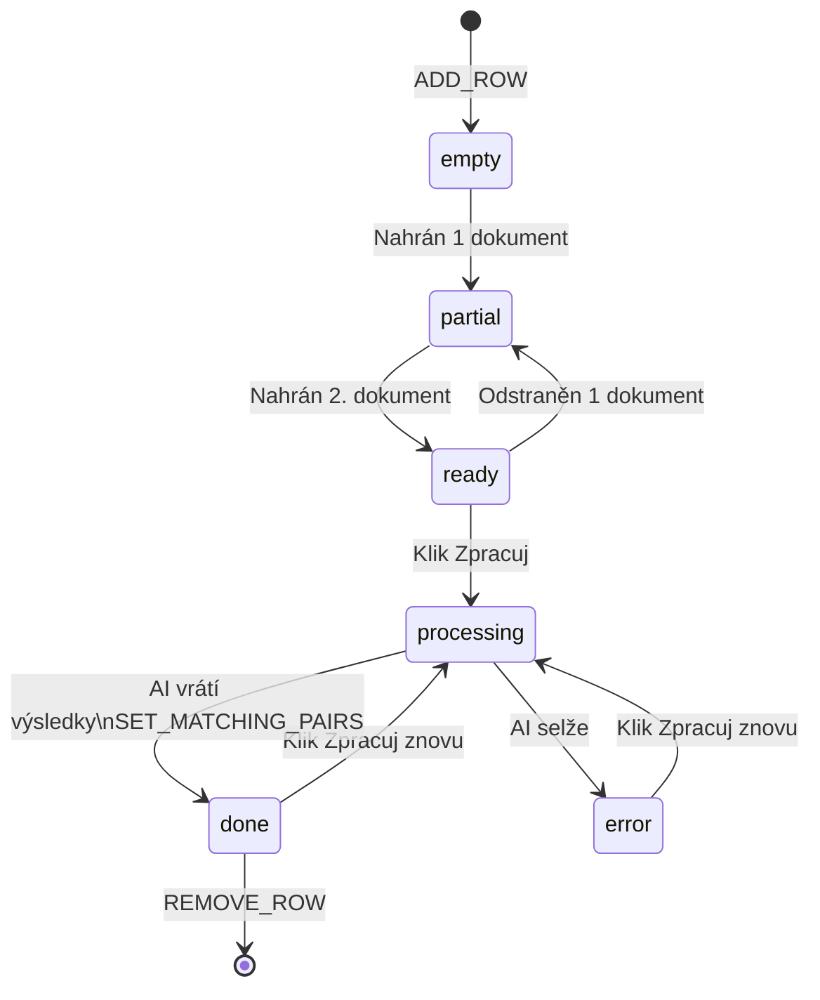

# Porovnání Dokladů – Diagramy flow

## 1. Celkový uživatelský flow

```mermaid
flowchart TD
    A([Start: Electron app]) --> B[Screen 1: Přehled\n/index.tsx]

    B --> C[Uživatel přidá řádek\nADD_ROW]
    C --> D[Drag & drop / výběr souboru\nFaktura PDF/PNG]
    C --> E[Drag & drop / výběr souboru\nPříjemka PDF/PNG]

    D --> F{Oba dokumenty\nnačteny?}
    E --> F

    F -- Ne --> G[status: partial]
    F -- Ano --> H[status: ready\nTlačítko Zpracuj aktivní]

    H --> I[Klik: Zpracuj]
    I --> J[status: processing]

    J --> K["🤖 AI VOLÁNÍ 1\nExtrakt položek z faktury\n(Gemini 2.5 Flash)"]
    J --> L["🤖 AI VOLÁNÍ 2\nExtrakt položek z příjemky\n(Gemini 2.5 Flash)"]

    K --> M{Oba extrakty\nhotovy?}
    L --> M

    M -- Chyba --> N[status: error\nAlert uživateli]
    M -- OK --> O["🤖 AI VOLÁNÍ 3\nPárování položek\n(Gemini 2.5 Flash)"]

    O -- Chyba AI --> P[Fallback:\nLevenshtein matching\n≥40% podobnost]
    O -- OK --> Q[Uložení párů\nSET_MATCHING_PAIRS]
    P --> Q

    Q --> R[status: done\nZobrazení souhrnů v řádku]

    R --> S[Klik: Detail]
    S --> T[Screen 2: Detail\n/detail/id]

    T --> U[3-sloupcový layout:\nNespárované faktury | Páry | Nespárované příjemky]
    U --> V[Uživatel ručně přesouvá\npomocí Drag & Drop\ndnd-kit]
    V --> W[Inline editace hodnot\nv PairBox]
    W --> X[Validace v reálném čase\ncompareRow]

    X --> Y{Checksum OK?}
    Y -- Zelená --> Z[Vše sedí ✓]
    Y -- Červená --> AA[Neshoda ✗]

    T --> AB[Export JSON\ncelého stavu]
    B --> AC[Import JSON\nobnovení stavu]
```

---

## 2. AI volání – detail



---

## 3. Datový model



---

## 4. Stavový automat – ComparisonRow



---

## 5. Validace – pravidla

```mermaid
flowchart LR
    subgraph Validace ["Validace (comparison-service.ts)"]
        A[MatchingPair[]] --> B[Součty za\nvšechny páry]
        B --> C{MJ / Množství\ndiff === 0?}
        B --> D{Cena bez DPH\nabs diff ≤ 5 Kč?}
        B --> E{DPH\nabs diff ≤ 5 Kč?}
        C -- Ano --> F[quantityValid ✓]
        C -- Ne --> G[quantityValid ✗]
        D -- Ano --> H[priceValid ✓]
        D -- Ne --> I[priceValid ✗]
        E -- Ano --> J[vatValid ✓]
        E -- Ne --> K[vatValid ✗]
    end

    F & H & J --> L{Všechny OK?}
    L -- Ano --> M[checksumValid ✓\nZelená]
    L -- Ne --> N[checksumValid ✗\nČervená]
```
